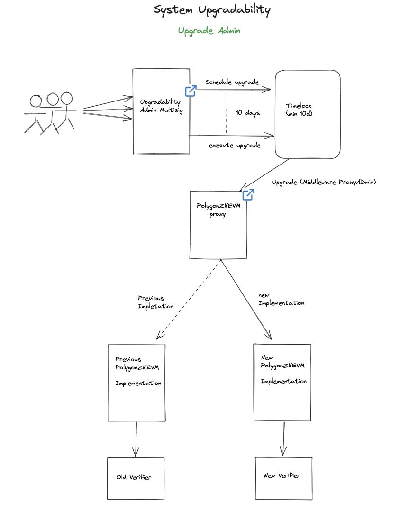

For the sake of securing the Polygon zkEVM, which is still in its Beta version, it is best to catch and prevent any possible vulnerabilities now than later.

Although Upgradeability is not a permanent feature of the Polygon zkEVM but only a part of the so-called _Training Wheels_, this document acts as a note on the process followed when upgrading.  

Upgrades on the Polygon zkEVM will only affect the following contracts:

- **PolygonZkEVM.sol** (Consensus Contract)
- **PolygonZkEVMGlobalExitRoot.sol**
- **PolygonZkEVMBridge.sol** (Bridge Contract)

A typical upgrade can only change the logic but not the state of the network. For instance, an upgrade affecting the zkEVM's Consensus Contract (or `PolygonZkEVM.sol`) could be changing the old _verifier contract_ to a new one. In this case, the logic will change from pointing to the old _verifier contract_ to the new one, leaving the state intact.

## Security Parameters

The security measures taken by the zkEVM team for an upgrade are on par with Ethereum's security standards as they involve the deployment of;

- An Admin Multisig Contract to avoid having one account controlling upgrades,
- A Timelock Contract to give users sufficient time delay to withdraw before execution, and
- A Transparent Upgradeable Proxy, from OpenZeppelin's libraries of audited and battle-tested contracts.

## Process Overview

As the need arises, and while Upgradeability is still permissible, a proposal for an upgrade can be made.

Before being sent to the Timelock Contract, the proposal needs to be signed by 2 out of 3 eligible signatories via the Admin Multisig Contract.

Once the conditions of the Admin Multisig Contract are satisfied, including a minimum of two signatures having been attached, scheduling of the proposed upgrade can be made with the Timelock Contract.

The time delay set for a zkEVM's upgrade is 10 days, after which the Admin triggers the Timelock Contract to execute the upgrade. This means the upgrade gets submitted to the L1 as a normal transaction.

In line with Transparent Upgradaeable Proxies, this ensures that the state of the zkEVM remains intact while the logic gets changed.

Following the above example of an upgrade on the Consensus Contract, the below depicts the process flow of a Polygon zkEVM upgrade.

## Benefits for Users

Firstly, the zkEVM team is committed to securing the system for the sake of protecting users' funds. As a result, any perceived threat to security, whether big or small, needs to be nipped in the bud.

Secondly, most upgrades often include optimizations, bug fixing, or a more accurate formula for effective gas pricing. This subsequently means fair and less transaction costs overall.

## Polygon's Governance Position

Polygon is committed to aligning itself with Ethereum's norms and values regarding L2 Governance. 

For more details on Polygon's stance and plans on Governance, please refer to [The 3 Pillars of Polygon Governance](https://forum.polygon.technology/t/the-three-pillars-of-polygon-governance-call-for-proposals/11847) post in the community forum. The first pillar can be found [here](https://forum.polygon.technology/t/the-first-pillar-protocol-governance/11972) and the second one [here](https://forum.polygon.technology/t/the-second-pillar-system-smart-contracts-governance/12151).

You can follow our updates on Governance [here](https://twitter.com/matrzeszowski/status/1669394085151375385).
