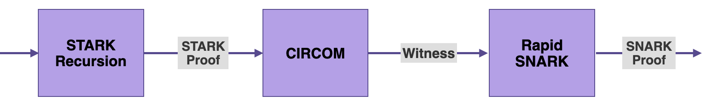
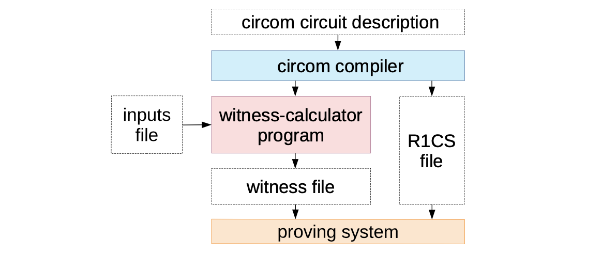
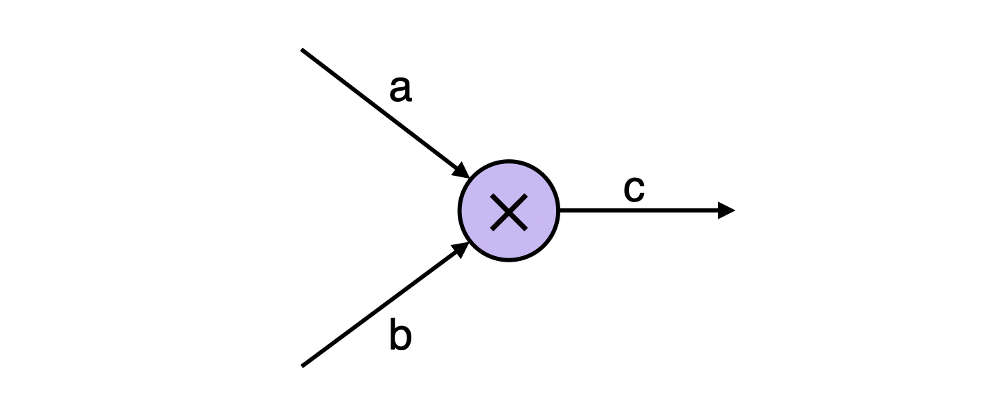

:::info

In this document we describe the CIRCOM component of the zkProver. It is one of the four main components of the zkProver, as outlined [here](https://wiki.polygon.technology/docs/zkEVM/zkProver/overview). These main components are; the Executor or Main State Machine, the STARK Recursion, CIRCOM and Rapid SNARK.

In this document we describe what CIRCOM is, and briefly describe some of its distinguishing features.

The reader is referred to the original [CIRCOM paper](https://www.techrxiv.org/articles/preprint/CIRCOM_A_Robust_and_Scalable_Language_for_Building_Complex_Zero-Knowledge_Circuits/19374986/1) for more details.

:::

## Introduction

As seen in the [zkProver Overview](https://zkevm.polygon.technology/docs/zkProver/overview) document, the output of the STARK Recursion component is a STARK proof.

The next step in the zkProver's process of providing a _validity proof_, is to produce the _witness_ akin to the output of the STARK Recursion.

Although the zkProver is designed as a state machine emulating the EVM, in order to generate this _witness_, it makes use of a tool based on the Arithmetic circuits model, called CIRCOM.

That is, CIRCOM takes the output of the STARK Recursion as input, so as to create its corresponding _witness_.

The _witness_ is in turn taken as input to the Rapid SNARK, which is used to generate a SNARK proof published as the validity proof.



In fact, CIRCOM takes a STARK proof as input and produces its corresponding _Arithmetic circuit_, expressed as the equivalent set of equations called _Rank-1 Constraint System_ (R1CS).

The set of valid circuit input, intermediate and output values satisfying the R1CS is actuallly the _witness_ related to the input STARK proof.

This document focuses on; what CIRCOM is, its common context of implementation, and how the zkProver utilises CIRCOM.

## Circuit Context

Arithmetic circuits are mostly used as standard models for studying the complexity of computations.

An _Arithmetic circuit_ is composed of addition and multiplication gates, and wires that carry values that are elements of a prime finite field $\mathbb{F}_p$, where $p$ is typically a very large prime number.

In the context of ZK-Proof protocols, a prover can use an Arithmetic circuit to prove knowledge of a valid assignment to all wires of the circuit.

And if the proof is correct, the verifier is convinced that the computation expressed as the Arithmetic circuit is valid, but learns nothing about the wires’ assigned values.

Arithmetic circuits are commonly encoded is in the form of a set of equations called _Rank-1 Constraint System_ (R1CS).

Once obtained, the R1CS can later be used by a zk-SNARK protocol to generate a verifiable proof.

A valid proof attests to the fact that the prover knows an assignment to all wires of the circuit that fulfills all the constraints of the R1CS.

An issue that arises, when applying ZK protocols to complex computations such as a circuit describing the logic of a ZK-rollup, is that the amount of constraints to be verified can be extremely large.

CIRCOM was developed for the very purpose of scaling complex Arithmetic circuits by realizing them as combined instatiations of smaller Arithmetic circuits.

## What is CIRCOM?

CIRCOM is a domain-specific language (DSL) used to define Arithmetic circuits, and it has an associated compiler of Arithmetic circuits to their respective Rank-1 Constraint Systems (or R1CSs).



### CIRCOM As A DSL

As described in the title of its [specifications paper](https://www.techrxiv.org/articles/preprint/CIRCOM_A_Robust_and_Scalable_Language_for_Building_Complex_Zero-Knowledge_Circuits/19374986/1), CIRCOM is a "language for building complex zero-knowledge circuits".

It is designed as a low-level circuit language, mimicking the design of electronic circuits, for naturally defining Arithmetic circuits.

As a _domain-specific language_ (DSL), it allows programmers to design and create Arithmetic circuits of their own choice, and later on apply these circuits to ZK tools.

One of the main peculiarities of CIRCOM is its _modularity_ as a language. It allows the definition of parameterizable small circuits called _templates_, which can be instantiated to form part of larger circuits.

In this regard, CIRCOM users can use _templates_ to create their own custom circuits with varied complexity.

However, CIRCOM users can also use templates from [CIRCOMLIB](https://github.com/iden3/circomlib), which is a publicly available library that contains hundreds of circuits such as; comparators, hash functions, digital signatures, binary and decimal converters.

### Circuits' Compiler

In addition to being a DSL used to define and create Arithmetic circuits, CIRCOM has a special compiler of Arithmetic circuits into their equivalent R1CSs.

The term "CIRCOM" is in fact short for "Circuit Compiler", implying that the CIRCOM compiler takes an Arithmetic circuit as input and outputs the following;

- A file with the R1CS description, containing the set of associated R1CS constraints, and
- A program written either in C++ or WebAssembly, for efficiently computing a valid assignment to all wires of the circuit (the _witness_).

The CIRCOM compiler is mainly written in Rust and it is open source.

## CIRCOM's Features

The CIRCOM language has its own peculiarities. The focus in this subsection is on a few features characteristic to CIRCOM.

Consider as an example, the $\texttt{Multiplier}$ circuit with input signals $\texttt{a}$ and $\texttt{b}$, and an output signal $\texttt{c}$ satisfying the constraint $\texttt{a} \times \texttt{b} \texttt{ - c = 0}$.



The figure above depicts a simple $\texttt{Multiplier}$ Arithmetic circuit with input wires labelled $\texttt{a}$ and $\texttt{b}$ and an output wire labelled $\texttt{c}$ such that $\texttt{a} \times \texttt{b\ = } \texttt{c}$. The wires are referred to as _signals_. The constraint related to this Multiplier circuit is:

$$
\texttt{a} \times \texttt{b} \texttt{ - c = 0}
$$

### The $\texttt{pragma}$ Instruction

The $\texttt{pragma}$ instruction specifies the version of the CIRCOM compiler being used. It is meant to ensure compatibility between the circuit and the compiler version. If the two are incompatible, the compiler throws a warning.

```circom
pragma circom 2.0.0;
```

As a precautionary measure, all files with the $\texttt{.circom}$ extension should start with a $\texttt{pragma}$ instruction. In the absence of this instruction, it is assumed that the code is compatible with the latest compiler version.

### Declaration Of Signals

In the Multiplier example, there are two input signals $\texttt{a}$ and $\texttt{b}$, and an output signal $\texttt{c}$.

In CIRCOM, each signal is given an identifier. However, the same sympols; $\texttt{a}$, $\texttt{b}$ and $\texttt{c}$ used for signals can also be identifiers.

The three signals are declared as follows,

```
  signal input a;
  signal input b;
  signal output c;
```

### The "$\mathtt{<==}$" Operator

The functionality of this operator is twofold;

- On the one hand, it sets a constraint that expresses that the value of $\texttt{c}$ must be the result of multiplying $\texttt{a}$ by $\texttt{b}$,
- On the other hand, the operator instructs the compiler in how to generate the program that computes the assignment of circuit signals.

```circom
c <== a * b;
```

### Creation Of Templates

One of the main peculiarities of CIRCOM is the allowance to define parameterizable small circuits called _templates_.

Templates are _parametrizable_ in the sense that their outputs depend on _free_ input values (i.e., values that are freely chosen by users).

They are general descriptions of circuits, that have some input and output signals, as well as a relation between the inputs and the outputs.

The following code shows how a $\texttt{Multiplier}\ \texttt{template}$ is created;

```
 pragma circom 2.0.0;

 template Multiplier () {
     // declaration of signals
     signal input a;
     signal input b;
     signal output c;
     // constraints
     c <== a * b;
 }
```

### Instantiation Of Templates

Although the above code succeeds in creating the $\texttt{Multiplier}\ \texttt{template}$, the template is yet to be instantiated.

In CIRCOM, the instantiation of a template is called a _component_, and it is created as follows;

```
component main = Multiplier();
```

The $\texttt{Multiplier}\ \texttt{template}$ does not depend on any parameter.

However, it is possible to initially create a generic, parametrizable template that can later be instantiated using specific parameters to construct the circuit.

Declaration of _components_ is the means by which CIRCOM enables programmers to work in a modular fashion.

Small circuits can be defined which can be combined to create larger circuits in accordance with the complexity of the computations needed to be carried out.

### Compiling a Circuit

As previously mentioned, the use of the operator "<==" in the $\texttt{Multiplier}\ \texttt{template}$ has dual functionality;

- It captures the arithmetic relation between signals, and
- It also provides a way to compute $\texttt{c}$ from $\texttt{a}$ and $\texttt{b}$.

In general, the description of a CIRCOM circuit also keeps dual functionality. That is, it performs both the _symbolic tasks_ and the _computational tasks_.

This enables the compiler to easily generate the R1CS describing a circuit, together with instructions to compute intermediate and output values of a circuit.

Given a circuit with the $\texttt{multiplier.circom}$ extension, the following line of code instructs the compiler to carry out the two types of tasks;

```
circom multiplier.circom --r1cs --c --wasm --sym
```

After compiling the $\texttt{.circom}$ circuit, the compiler returns four files;

- A file with the R1CS constraints, (_symbolic task_)
- A C++ program for computing values of the circuit wires, (_computational task_)
- A WebAssembly program for computing values of the circuit wires, (_computational task_)
- A file of symbols for debugging and printing the constraint system in an annotated way. (_symbolic task_)

At this stage, either one of the C++ or WebAssembly programs generated by the compiler can be used to compute all signals that match the set of constraints of the circuit.

Whichever program is used, needs as input, a file containing a set of valid input values.

Recall that a valid set of circuit input, intermediate and output values is called the _witness_.

### Private And Public Signals

Depending on the $\texttt{template}$ being used, some signals are $\texttt{private}$ while others are $\texttt{public}$.

In the case of the $\texttt{Multiplier}\ \texttt{template}$, a signal is $\texttt{private}$ by default, unless it is declared to be $\texttt{public}$ in the instantiation of the template as shown below.

```
component main {public [a]} = Multiplier();
```

According to the above line, the input signal $\texttt{a}$ is $\texttt{public}$, while $\texttt{b}$ is $\texttt{private}$ by default.

### Main Component

The CIRCOM compiler needs a specific component as an entry point. And this initial component is called $\texttt{main}$.

In the same way the $\texttt{Multiplier}\ \texttt{template}$ needed instantiation as a component, so does the $\texttt{main}$ component.

However, unlike other intermediate components, the $\texttt{main}$ component defines global input and output signals of a circuit.

Denote a list of $\texttt{n}$ signals by $\{\mathtt{ s1, s2, \dots , sn }\}$.

The general syntax to specify the main component is the following:

```
component main {public [s1,..,sn]} = templateID(v1,..,vn);
```

Specifying the list of public signals of the circuit, indicated as $\{\texttt{public [s1,..,sn]}\}$, is optional.

Note that global inputs are considered $\texttt{private}$ signals while the global outputs are considered $\texttt{public}$.

However, the main component has a special attribute to set a list of global inputs as public signals.

The rule of thumb is: Any other input signal not included in this list $\{\texttt{public [s1,..,sn]}\}$, is considered a private.

### Concluding CIRCOM's Features

There are many more features that distinguish CIRCOM from other known ZK-tools. The rest of these features delineated in the original [CIRCOM paper](https://www.techrxiv.org/articles/preprint/CIRCOM_A_Robust_and_Scalable_Language_for_Building_Complex_Zero-Knowledge_Circuits/19374986/1).

We conclude this subsection by putting together the mentioned CIRCOM features in one code example.

The $\texttt{Multiplier}\ \texttt{template}$ is again used as an example. But the $\texttt{pragma}$ instruction is omitted for simplicity's sake.

```
template Multiplier() {
  signal input a;
  signal input b;
  signal output c;
	c <== a * b;
	}

	component main {public [a]} = Multiplier();
```
