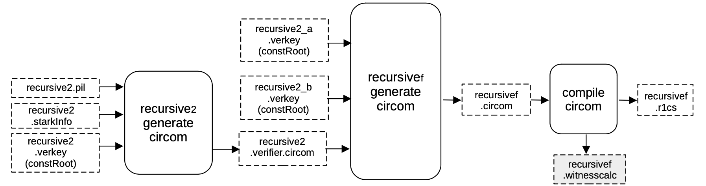
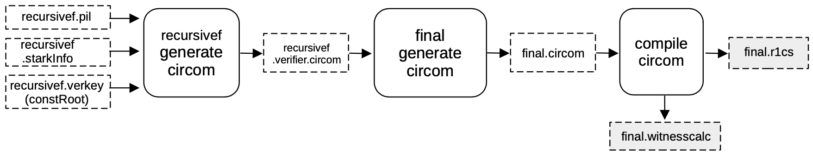

This section focuses on the final step of the proof recursion, where the last but one _intermediate_ STARK proof, referred to as `recursivef`, is verified. As well as the very last conversion of a STARK proof to a circuit.

## Setup S2C for recursivef

The idea here is the same as seen before when executing a $\texttt{S2C}$: It is to generate a CIRCOM circuit that verifies $\mathtt{\pi_{rec2}}$, by mimicking the FRI verification procedure.

In order to achieve this, a verifier circuit $\texttt{recursive2.verifier.circom}$ is generated from the previously obtained files;

- The $\texttt{recursive2.pil}$ file,
- The $\texttt{recursive2.starkinfo}$ file and
- The constant roots of the previous two proofs $\mathtt{recursive2\_} \texttt{a.verkey.constRoot}$ and $\mathtt{recursive2\_b.} \texttt{verkey.constRoot}$;

by filling the $\mathtt{stark\_} \texttt{verifier.circom.ejs}$ template.

The output CIRCOM file $\texttt{recursivef.circom}$, obtained by running a different script called $\texttt{genrecursivef}$, is in turn compiled into an R1CS $\texttt{recursivef.r1cs}$ file and a $\text{witness calculator program}$ $\texttt{recursivef.witnesscal}$.

Both these outputs are used later on, to build and fill the next execution trace.

## Setup C2S for recursivef

A $\texttt{C2S}$ is again executed in this step. Hence a machine-like construction is obtained from the R1CS description of the verification circuit.

And, this construction must be the one whose execution correctness is equivalent to the validity of the previous circuit.

In this case, the R1CS description is in the file $\texttt{recursivef.r1cs}$, and the obtained construction is described by $\texttt{recursivef.pil}$.

Again, a binary for all the constant polynomials $\texttt{recursivef.const}$ is generated, together with the helper file $\texttt{recursivef.exec}$, which provides allocation of the witness values into their corresponding positions in the execution trace.

Since all FRI-related parameters are stored in a $\texttt{recursive.starkstruct}$ file, and this file is coupled with,

- the $\texttt{recursivef.pil}$ file as inputs to the $\mathtt{generate\_starkinfo}$ service in order to generate the $\texttt{recursivef.starkinfo}$ file, and
- the $\texttt{recursivef.const}$ as inputs to the component that builds the Merkle tree of evaluations of constant polynomials, $\texttt{recursivef.consttree}$, and its root $\texttt{recursivef.verkey}$.

## Setup S2C for final

As done previously when executing a $\texttt{S2C}$, a CIRCOM circuit that verifies $\mathtt{\pi_ {recf}}$ is generated by mimicking the FRI verification procedure.

In order to achieve this, a verifier circuit $\texttt{recursivef.verifier.circom}$ is generated from the previously obtained files;

- The $\texttt{recursivef.pil}$ file,
- The $\texttt{recursivef.starkinfo}$ file and
- The constant roots of the previous two proofs $\mathtt{recursivef\_} \texttt{a.verkey.constRoot}$ and $\mathtt{recursivef\_b.} \texttt{verkey.constRoot}$,

by filling the $\mathtt{stark\_} \texttt{verifier.circom.ejs}$ template.

This verifier CIRCOM file gets imported by the $\texttt{final.circom}$ circuit in order to generate the circuit being proved, using $\texttt{Groth16}$ procedure.

