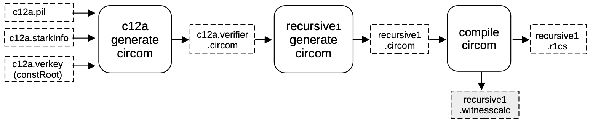
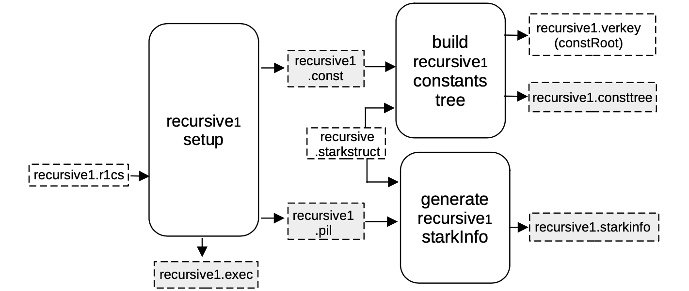
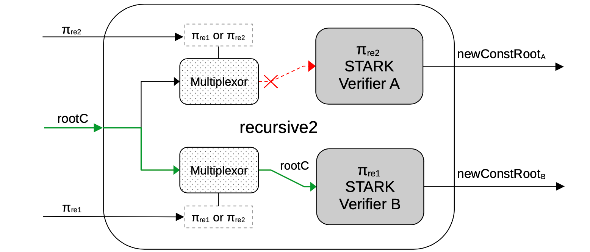
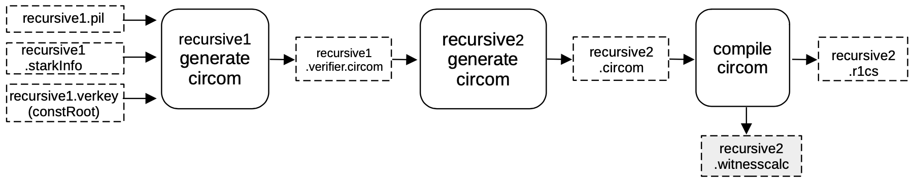
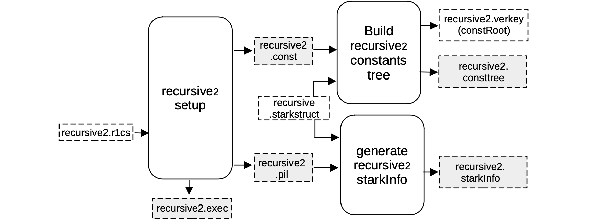

This section focuses on describing the conversion of a STARK proof to a verifier circuit, and conversely, as required in the Aggregation Stage of the Proving Architecture.

The first step of the proof recursion, where the first STARK proof is verified, is referred to as $\texttt{recursive1}$. All intermediate steps of recursion are referred to as $\texttt{recursive2}$, while the last step is called $\texttt{recursivef}$.

### Setup $\textbf{S2C}$ for $\textbf{recursive1}$

At this point, the first STARK proof $\pi$ has been validated with a STARK proof $\pi_\texttt{c12a}$.

The idea now is to generate a CIRCOM circuit that verifies $\pi_\texttt{c12a}$, by mimicking the FRI verification procedure.

In order to achieve this, a verifier circuit $\texttt{c12a.verifier.circom}$ is generated from the previously obtained files;

- the $\texttt{c12a.pil}$ file,
- the $\texttt{c12a.starkinfo}$ parameters, and
- the constant root $\texttt{c12a.verkey.constRoot}$,

by filling the $\mathtt{stark\_} \texttt{verifier.circom.ejs}$ template as before.

In this case, as mentioned in the Normalization stage subsection of the _Recursion_ section, in order to include the constant root as a public input, the circuit had to be slightly modified.

This will be extremely important in the Aggregation stage, where all the constants for the computation, which depend on the previous circuit, need to be provided as public inputs.

This is done by using the $\texttt{recursive1.circom}$ file and importing inside the previously generated $\texttt{c12a.verifier.circom}$ circuit as a library.

The verifier circuit is instantiated inside $\mathtt{recursive1.circom}$, connecting all the necessary wires and including the constant root to the set of publics.

The output circom file $\texttt{recursive1.circom}$ , is compiled into a R1CS $\texttt{recursive1.r1cs}$ file and a `witness calculator program`, $\mathtt{recursive1.witnesscal}$, which will be used for both building and filling the next execution trace.

### Setup $\textbf{C2S}$ for $\textbf{recursive1}$

As seen previously, a machine-like construction, whose correct execution is equivalent to the validity of the previous circuit, is obtained from the R1CS description of the verification circuit.

In this case, the R1CS description is in the file $\texttt{recursive1.r1cs}$, and the obtained construction is described by $\texttt{recursive1.pil}$.

Again, a binary for all the constant polynomials $\texttt{recursive1.const}$ is generated, together with the helper file $\texttt{recursive1.exec}$, which provides allocation of the witness values into their corresponding positions in the execution trace.

Note that all the FRI-related parameters are stored in a $\texttt{recursive.starkstruct}$ file (located in the prover repository), and it is coupled with,

- the $\texttt{recursive1.pil}$ file as inputs to the $\mathtt{generate\_starkinfo}$ service in order to generate the $\texttt{recursive1.starkinfo}$ file, and
- the $\texttt{recursive1.const}$ as inputs to the component that builds the Merkle tree of evaluations of constant polynomials, $\texttt{recursive1.consttree}$, and its root $\texttt{recursive1.verkey}$.

In this case, a blowup factor of $2^4 = 16$ is used, and thus allowing the number of queries to be $32$.

### Setup $\textbf{S2C}$ for $\textbf{recursive2}$

As before, a CIRCOM circuit is generated that verifies $\mathtt{π_{rec1}}$ by imitating the FRI verification procedure.

In order to do this, a verifier circuit $\texttt{recursive1.verifier.circom}$ is generated from the previously obtained files;

- the $\texttt{recursive1.pil}$ file,
- the $\texttt{recursive1.starkinfo}$ file, and
- the constant root $\texttt{recursive1.verkey.constRoot}$,

by filling the verifier $\mathtt{stark\_verifier.} \texttt{circom.ejs}$ template.

Once the verifier is generated using the template, the template is used to create another CIRCOM that aggregates two verifiers.

Note that, in the previous step, the constant root was passed harcoded from an external file into the circuit.

That's the very reason for having the Normalization stage: enabling the previous circuit and anyone verifying each or both proofs to have the exact same form, and thus allowing iterated recursion.

Henceforth, the $\texttt{recursive2.circom}$ circuit has two verifiers and two multiplexors that are actually deciding the form of each of the verifiers:

- if the proof is $\mathtt{\pi_{rec1}}$-type, the hardcoded constant root is input, but
- if the proof is a $\mathtt{\pi_{rec2}}$-type, the constant root should be connected as an input signal, coming from a previous circuit.

A schema of the $\texttt{recursive2}$ circuit generated is as shown in the below Figure.

Observe that, since the upper proof is of the $\mathtt{\pi_{rec2}}$-type, the Multiplexor does not provides the constant root `rootC` to the $\texttt{Verifier}\ \texttt{A}$ for hardcoding it, because this verifier should get it through a public input from the previous circuit.

Otherwise, since the lower proof has the $\mathtt{\pi_{rec1}}$-type, the Multiplexor lets it pass through by providing the constant root to the Verifier B, so that it can be hardcoded when the corresponding template is filled.

The output CIRCOM file $\texttt{recursive2.circom}$ , is obtained by running a different script called $\texttt{genrecursive}$ which is compiled into an R1CS $\texttt{recursive2.r1cs}$ file and a witness calculator program $\texttt{recursive2.witnesscal}$ and they will both be used, later on, to build and fill the next execution trace.

### Setup $\textbf{C2S}$ for $\textbf{recursive2}$

As seen before, when executing a $\texttt{C2S}$, a machine-like construction gets obtained from the R1CS description of the verification circuit.

This construction is specifically the one whose execution correctness is equivalent to the validity of the previous circuit. And it is described by a PIL $\texttt{recursive2.pil}$ file.

The R1CS description taken as input to produce this construction is in the file $\texttt{recursive2.r1cs}$.

The other outputs of the $\texttt{recursive2}\ \texttt{setup}$ component are;

- A binary for all the constant polynomials $\texttt{recursive2.const}$, and
- The helper file $\texttt{recursive2.exec}$, which provides allocation of the witness values into their corresponding positions in the execution trace.

Note that all the FRI-related parameters are stored in a $\texttt{recursive.starkstruct}$ file, and in the next step, it is paired up with,

- the $\texttt{recursive1.const}$ as inputs to the component that builds the Merkle tree of evaluations of constant polynomials, $\texttt{recursive2.consttree}$ and its root $\texttt{recursive2.verkey}$.
- the $\texttt{recursive2.pil}$ file as inputs to the $\mathtt{generate\_starkinfo}$ service in order to generate the $\texttt{recursive1.starkinfo}$ file.

In this case, we are using the same blowup factor of $2^4 = 16$, allowing the number of queries to be $32$.

