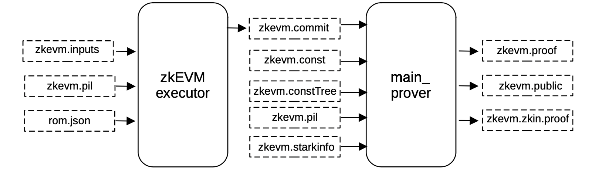
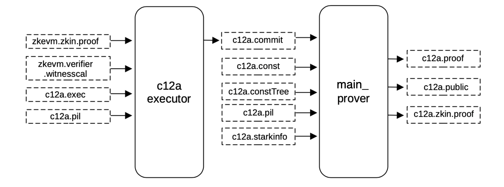
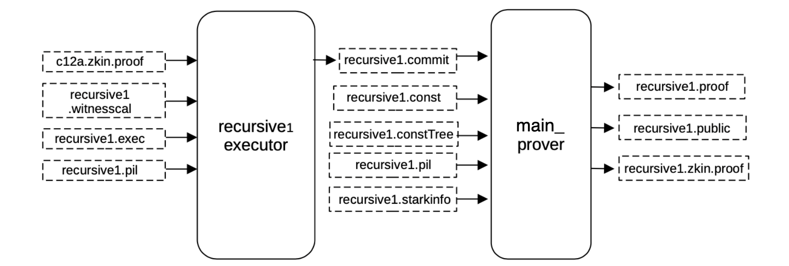
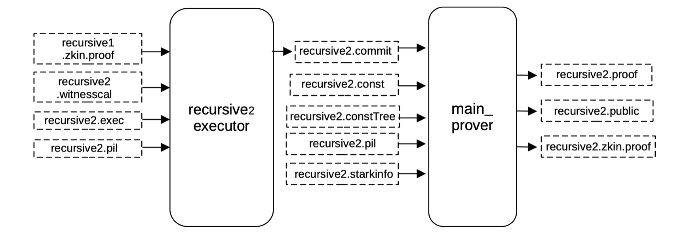
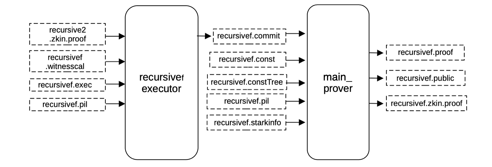

# Proof Generation Phase

This section explains the proof generation phase for all proofs; the zkEVM STARK, the compression $\texttt{c12a}$ step, the recursion proof $\texttt{recursion1}$, the intermediate recursion proof $\texttt{recursion2}$ and the final recursion proof $\texttt{recursionf}$.

## Proof of the zkEVM STARK

The execution trace has up to this point been built, together with a PIL file describing the ROM of the zkEVM. Given these two, a STARK proof which attests to the correct execution of the zkEVM, can be generated using the PIL-STARK tooling explained in the previous sections of this documentation (specifically [here](/zkProver/pil-stark).)

In this step, a blowup factor of 2 is used, so the proof becomes quite big due to a huge amount of polynomials.

The compression step $\texttt{c12a}$ was added for this very reason, raising the blowup factor and thus reducing the number of polynomials.

In order to generate the proof, the $\mathtt{main\_prover}$ service is used, and requires as input;

- the execution trace (that is, the committed and constant polynomials files generated by the executor using the PILCOM package),
- the constant tree binary file in order to be hashed to compute the constant root,
- the PIL file of the $\text{zkEVM ROM}$ $\texttt{zkevm.pil}$, and
- all the information provided by the $\texttt{zkevm.starkinfo.json}$ file,

including all the FRI-related parameters such as the blowup factor or the configuration of the steps.

This step is intended to start the recursion, and therefore differs from the subsequent ones. However, aiming at uniformity of the code, the Main Prover procedure chooses to abstract the notion of proving. And it is intended to be the same at each step of the recursion.

### Proof of c12a

In order to generate the proof verifying the previous $\texttt{zkevm.proof}$, all the witness values can be generated and mapped correctly into its corresponding position of the execution trace in the same exact manner as before, obtaining a binary file $\texttt{c12a.commit}$ for the committed polynomials of the execution trace.

Having the execution trace (that is, the committed and constant polynomials filled) and the PIL, a proof validating the previous big STARK proof can be generated.

The same $\mathtt{main\_prover}$ service used earlier is again used here, and as before it takes as input the previously built constant tree $\texttt{c12a.constTree}$ and the $\texttt{c12a.starkinfo}$ file.

It in turn generates the proof $\texttt{c12a.proof}$ and the publics $\texttt{c12a.public}$ combined in the $\texttt{c12a.zkin.proof}$ file.

### Proof of recursive1

In order to generate the proof that verifies the previous $\texttt{c12a.proof}$, all the witness values are generated and mapped correctly into their corresponding positions of the execution trace in the exact same way as before, obtaining a binary file $\texttt{recursive1.commit}$ for the committed polynomials of the execution trace.

Having the execution trace (that is, the committed and constant polynomials filled) and the PIL, a proof validating the previous big STARK proof can be generated.

The same $\mathtt{main\_prover}$ service used previously is applied again here, it again takes as input the previously built constant tree $\texttt{recursive1.constTree}$ and the $\texttt{recursive1.starkinfo}$ file.

This generates the proof and the publics joined in the $\texttt{recursive1.zkin.proof}$ file.

### Proof of recursive2

To generate the proof verifying the previous $\texttt{recursive1.proof}$, all witness values must be generated and mapped correctly into their corresponding positions of the execution trace in the exact same way as before, obtaining a binary file $\texttt{recursive2.commit}$ for the committed polynomials of the execution trace.

Having the execution trace (that is, the committed and constant polynomials filled) and the PIL, a proof validating the previous big STARK proof can generated.

The same service $\mathtt{main\_prover}$ generates this proof, as it was done before, it takes as inputs the previously built constant tree $\texttt{recursive2.constTree}$ and the $\texttt{recursive2.starkinfo}$ file.

This generate the proof and the publics combined in the $\texttt{recursive2.zkin.proof}$ file.

### Proof of recursivef

To generate the proof verifying the previous $\texttt{recursive2.proof}$, we generate all the witness values and map them correctly into its corresponding position of the execution trace exactly in the same way as before, obtaining a binary file $\texttt{recursivef.commit}$ for the committed polynomials of the execution trace.

Having the execution trace (that is, the committed and constant polynomials filled) and the PIL, we can generate a proof validating the previous big STARK proof.

Again, the same $\mathtt{main\_prover}$ service is used to generate the proof. As before, it takes as inputs the previously built constant tree $\mathtt{recursivef.constTree}$ and the $\mathtt{recursivef.starkinfo}$ file.

This will generate the proof and the publics joined in the $\texttt{recursivef.zkin.proof}$ file.

### Proof of the final Stage

The last circuit, $\texttt{final.circom}$ is the one used to generate the proof. At this moment a $\texttt{Groth16}$ proof is generated.

## Remarks

The setup phase runs with the proverjs. The proof generation runs with the prover written in $\text{C}$. The circuits build in the setup phase can be used as many times as desired. The prover receives the information about the particular composition of proofs with an $\text{RPC}$ $\text{API}$.
