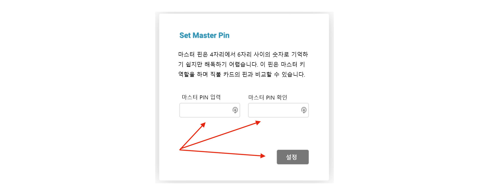
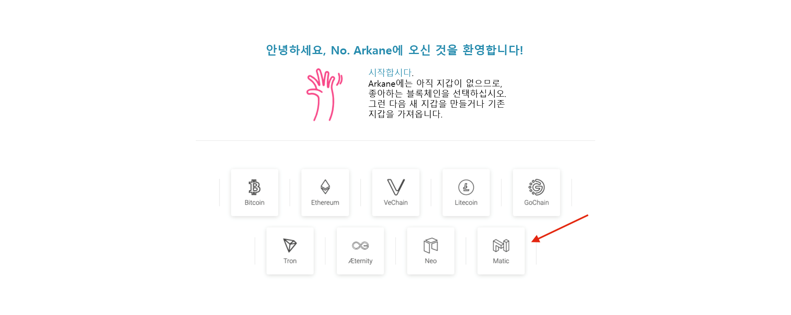

사용자 친화적인 폴리곤 지갑을 찾고 있다면, 아케인 지갑 생성을 고려해보세요. 복구 메커니즘을 활성화하고 인앱 채팅을 통한 최종 사용자 지원과 함께 제공되므로 놀라운 암호화폐의 땅에서 길을 잃지 않게 해줍니다.

## Step 1. Arkane에 가입하기

https://arkane.network/ 로 이동하여 우측 상단 모서리에 있는 'YOUR WALLET'버튼을 클립합니다.

Arkane이 처음이라면 'Create Account'를 클릭하세요. 소셜 자격 증명이나 이메일 및 비밀번호를 사용하여 Arkane에 가입할 수 있습니다.

소셜 계정 중 하나(가장 빠름) 또는 이메일 주소와 비밀번호로 가입한 후. 이용약관에 동의해야 합니다.

지갑을 보호하려면 PIN을 구성해야 합니다. PIN은 4자리에서 6자리 사이여야 합니다.

## Step 2. 지갑 생성하기
이제 PIN을 구성했으므로 폴리곤 지갑을 만들 준비가 되었습니다. 목록에서 폴리곤을 선택하기만 하면 됩니다.

새로운 지갑을 만려면 *'Create new wallet'* 을 누르십시오.

버튼을 누르면 Arkane이 PIN(몇 단계 전에 구성한 것)을 사용하여 확인을 요청합니다. 그 후 지갑이 생성되고 대시보드로 이동합니다.

## 🥳 축하합니다!

드디어 폴리곤 블록체인에서 디지털 자산을 관리할 수 있는 폴리곤 지갑을 만들었습니다. 

