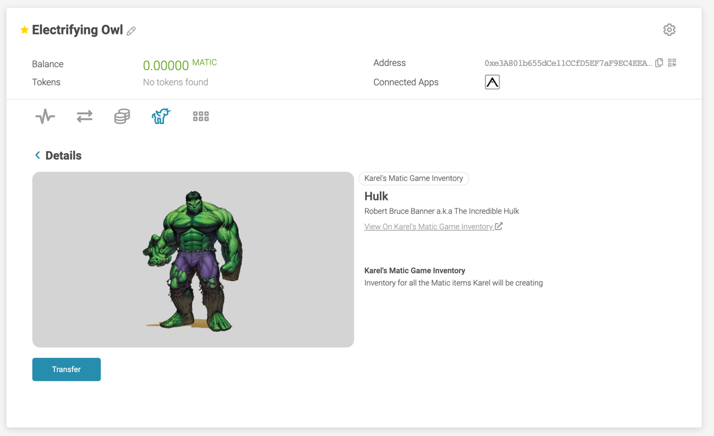

> 맞춤형 대체가능 및 대체불가능 토큰

### 대체가능
개발자는 [Arkane Git repository](https://github.com/ArkaneNetwork/content-management/tree/master/tokens)에 대한 토큰 세부 정보가 포함된 작은 풀 요청을 만들어 맞춤형 ERC20 토큰에 대한 지원을 쉽게 추가할 수 있습니다. 다음은 제공해야 하는 정보를 발췌한 인용문입니다:
```
{"name":"SAND","symbol":"SAND","address":"0x3845badade8e6dff049820680d1f14bd3903a5d0","decimals":18,"type":"ERC20"}
```
또는 인앱 채팅을 통해 언제든지 연락하여 토큰을 추가하도록 요청할 수 있습니다.

### 대체불가능
Arkane은 ERC721 및 ERC1155 표준을 따르는 경우 맞춤형으로 생성된 NFT를 자동으로 🤩 선택하는 방식으로 서비스를 개발했습니다. 현재까지 폴리곤 블록체인에 있는 모든 NFT를 표시할 수 있는 유일한 지갑입니다.


